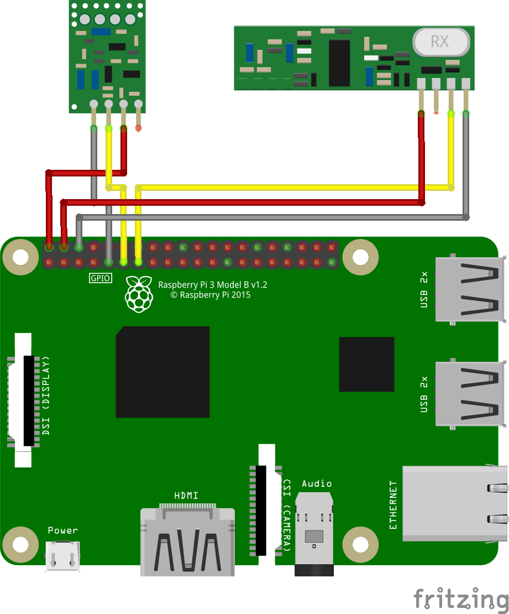

# 433Utils

This project is a simple portage in TypeScript of the repository [433Utils](https://github.com/ninjablocks/433Utils).
This repository simply calls the various executables of the ported library.

The `.cpp` files have been modified (in `/custom433Utils/`) to pass the PIN as argument (and thus not to build the files each time the PIN is modified).

## Installation

```
git clone https://github.com/baudev/433Utils.git
cd 433Utils/
npm install
npm run build
```

## Usage

### Receive

This listener allows you to listen to data received by the receiver on the specified PIN.

```typescript
let receiver = new Receiver(0); // Set PIN
receiver.setOnReceiveListener((data) => {
    // handle data value
});
```

### Send

```typescript
let transmitter = new Transmitter(1); // Set PIN
transmitter.send(123, 2, 1)
    .then((values) => {
        // message sent
    });
```

You can find a simplistic example in the `example.ts` file.

## Note

The PIN parameters correspond to those of the WiringPi library. The mapping table can be found [here](http://wiringpi.com/wp-content/uploads/2013/03/pins.pdf).

This project needs:

- Raspberry PI
- 433 Mhz Transmitter (TX)
- 433 Mhz Receiver (RX)

<p align="center">
  
</p>